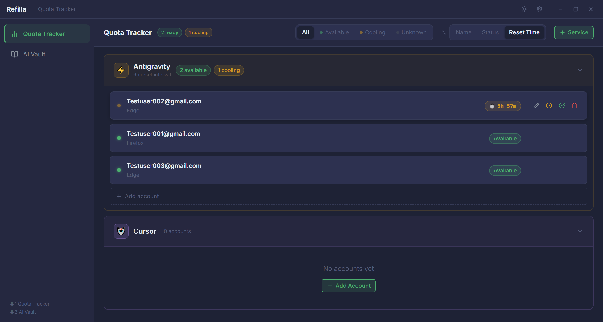
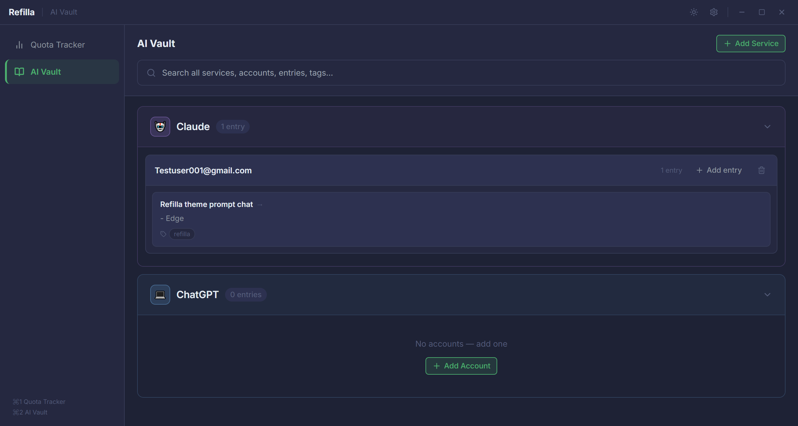

<div align="center">
<br/>
<pre>
██████╗ ███████╗███████╗██╗██╗     ██╗      █████╗ 
██╔══██╗██╔════╝██╔════╝██║██║     ██║     ██╔══██╗
██████╔╝█████╗  █████╗  ██║██║     ██║     ███████║
██╔══██╗██╔══╝  ██╔══╝  ██║██║     ██║     ██╔══██║
██║  ██║███████╗██║     ██║███████╗███████╗██║  ██║
╚═╝  ╚═╝╚══════╝╚═╝     ╚═╝╚══════╝╚══════╝╚═╝  ╚═╝
</pre>

**Track AI quota resets. Organize your accounts. Stay in control.**

<br/>


<br/>

> *Built for developers running multiple free-tier AI accounts across tools like Cursor, Windsurf, and GitHub Copilot. Refilla tells you which account is ready, which is cooling down, and reminds you the moment a quota resets — all offline, all yours.*

<br/>

</div>

---

## ✨ What is Refilla?

If you rotate between multiple free-tier AI accounts to keep working without interruptions, you know the pain: you forget which account is on cooldown, you log into the wrong one, you miss the reset window. Refilla fixes that.

It's a **lightweight desktop app** that lives in your system tray and does two things really well:

- 🟢 **Quota Tracker** — see every account's status at a glance. Mark a cooldown with one click, set the reset time, and get a desktop notification the moment it's ready.
- 🔵 **AI Vault** — a personal reference database. Save conversation titles, notes, and context per account so you always know *which account has which conversation* without logging into everything.

**100% offline. Nothing leaves your machine. Ever.**

---

## 🖥️ Screenshots

<div align="center">

 &nbsp; 

</div>

---

## 🚀 Features

### Quota Tracker
- 🟢 **Live countdown** — see exactly how long until each account resets
- 🔔 **Desktop notifications** — get notified the moment a quota resets, even when minimized
- ⚡ **Quick presets** — mark cooldown with +24h, +48h, +3d, +7d, or +30d in one click
- 📂 **Service sections** — group accounts by tool (Cursor, Windsurf, Copilot, etc.)
- 🔍 **Filter & sort** — view only available, only cooling down, or sort by reset time
- 🕐 **Smart auto-recover** — accounts that reset while the app was closed are auto-updated on launch

### AI Vault
- 📝 **Account-level notes** — save key-value entries per account per service
- 🔎 **Master search** — search across all services, all accounts, all notes at once
- 🔍 **Per-section search** — scope a search to one service only with text highlighting
- 🏷️ **Tags** — tag entries for faster filtering
- 📤 **Export / Import** — back up your vault as JSON anytime

### App-wide
- 🌙 **Dark & light theme** — on-brand dark default with green accent, clean light mode available
- 🖥️ **System tray** — runs quietly in the background with app logo and instant access
- ⌨️ **Keyboard shortcuts** — `Ctrl+1/2` to switch tabs, `Ctrl+,` for settings, `Escape` to close
- 💾 **Fully local** — all data stored in a JSON file on your own machine
- 🔒 **No telemetry, no analytics, no internet** — ever

---

## 📦 Installation

### Download (recommended)

Go to the [**Releases**](../../releases) page and download the latest version:

| OS | File | Notes |
|----|------|-------|
| Windows | `Refilla-Setup-x.x.x.exe` | Run installer, creates desktop shortcut |
| Linux | `Refilla-x.x.x.AppImage` | No install needed, just run |

**Windows:** Double-click the `.exe`. Windows SmartScreen may warn about an unsigned app — click **More info → Run anyway**.

**Linux:**
```bash
chmod +x Refilla-x.x.x.AppImage
./Refilla-x.x.x.AppImage
```

---

## 🛠️ Build from Source

### Prerequisites

- [Node.js](https://nodejs.org/) v18 or higher
- npm v9 or higher
- Git

### Setup

```bash
# Clone the repo
git clone https://github.com/yourusername/refilla.git
cd refilla

# Install dependencies
npm install

# Start in development mode
npm run dev
```

### Build installers

```bash
# Windows (.exe NSIS installer)
npm run build:win

# Linux (.AppImage)
npm run build:linux

# Both at once
npm run build
```

Output files will be in the **`release/`** folder:

| OS | Output file |
|----|-------------|
| Windows | `release/Refilla Setup x.x.x.exe` |
| Linux | `release/Refilla-x.x.x.AppImage` |

---

## 🚢 Publishing a GitHub Release

### Step 1 — Build locally

```bash
npm run build:win
```

The installer appears at `release/Refilla Setup 1.0.0.exe`.

### Step 2 — Tag the version

```bash
git add .
git commit -m "chore: release v1.0.0"
git tag v1.0.0
git push && git push --tags
```

### Step 3 — Create the GitHub Release

1. Go to your repo on GitHub → **Releases** → **Draft a new release**
2. Choose the tag you just pushed (e.g. `v1.0.0`)
3. Add a title: `Refilla v1.0.0`
4. Write release notes (what changed, what's new)
5. Drag and drop the file from `release/` into the **Assets** area:
   - `Refilla Setup 1.0.0.exe` (Windows)
   - `Refilla-1.0.0.AppImage` (Linux, if built)
6. Click **Publish release**

> Users will then see a **Download** button directly on the Releases page.

### Automated releases (GitHub Actions)

If you add `.github/workflows/release.yml` to the repo, every time you push a `v*` tag, GitHub Actions will automatically build the Windows installer and attach it to a release — no manual upload needed.

---

## 📁 Data & Storage

Refilla stores all data in a single JSON file using `electron-store`. No database, no server.

**Data file location:**

| OS | Path |
|----|------|
| Windows | `%APPDATA%\refilla\config.json` |
| Linux | `~/.config/refilla/config.json` |

### Backup & Restore

Open the Settings panel (`Ctrl+,` or the gear icon) and use:

- **Export all data** — saves a full JSON backup to any folder you choose
- **Import data** — restore from a backup (merge or replace existing data)
- **Open data folder** — opens the folder directly in your file explorer

> ⚠️ **Important:** Refilla is **not** a password manager. The AI Vault is unencrypted plain text. Do not store real API keys, passwords, or sensitive secrets in it.

---

## ⌨️ Keyboard Shortcuts

| Shortcut | Action |
|----------|--------|
| `Ctrl + 1` | Switch to Quota Tracker |
| `Ctrl + 2` | Switch to AI Vault |
| `Ctrl + ,` | Open Settings |
| `Escape` | Close modal or panel |

---

## 🗺️ Roadmap

- [ ] Drag-and-drop reordering of accounts within a service
- [ ] Custom notification sounds
- [ ] Account usage history / log
- [ ] CSV export for Vault entries
- [ ] Auto-detect reset time from clipboard (paste a "quota exceeded" message)
- [ ] GitHub Actions automated release pipeline

---

## 🤝 Contributing

Refilla is a personal tool built for personal use, but PRs and issues are welcome.

1. Fork the repo
2. Create a feature branch: `git checkout -b feature/my-feature`
3. Commit your changes: `git commit -m 'add my feature'`
4. Push and open a Pull Request

---

## 📄 License

MIT — do whatever you want with it.

---

<div align="center">

Built with 💚 for developers who hustle on free tiers.

**[⬆ back to top](#)**

</div>
